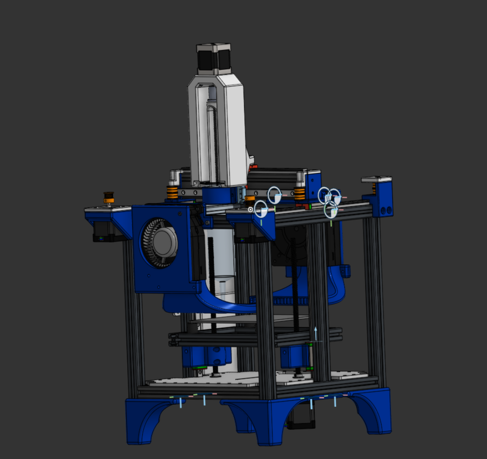

# ICE3DP

## What is this?

A CoreXY 3D printer that prints Icing in a 150x150x50 mm cube!

It has sheet cooling as well as dual z drive by one nema 17 and using a nema 17 on the toolhead that drives a lead screw to extrude icing.

## Images

## BOM

| Item                     | Description        | Qty | Unit Price ($) | Shipping | Total ($) | URL | Running Total ($ with Tax) |
|--------------------------|--------------------|-----|-----------------|----------|-----------|-----|-----------------------------|
| 2020 Extrusion           | HFS5-2020-160      | 2   | 4.93            |          | 9.86      | https://us.misumi-ec.com/ | 10.51 |
| 2020 Extrusion           | HFS5-2020-290      | 2   | 4.93            |          | 9.86      | https://us.misumi-ec.com/ | 21.02 |
| 2020 Extrusion           | HFS5-2020-250      | 8   | 4.93            |          | 39.44     | https://us.misumi-ec.com/ | 63.07 |
| 2020 Extrusion           | HFS5-2020-184      | 2   | 4.93            |          | 9.86      | https://us.misumi-ec.com/ | 73.58 |
| 2020 Extrusion           | HFS5-2020-270      | 4   | 4.93            |          | 19.72     | https://us.misumi-ec.com/ | 94.61 |
| 2040 Extrusion           | HFS5-2040-270      | 1   | 5.75            | 21.87    | 27.62     | https://us.misumi-ec.com/ | 124.06 |
| Sheet Metal Plate        | Sheet Metal        | 1   | 14.51           | 25.35    | 39.86     | https://jlccnc.com/ | 166.56 |
| NEMA 17                  | Dupont 48 mm       | 1   | 41.52           | 8.26     | 49.78     | https://www.aliexpress.us/item/3256801583088255.html | 219.64 |
| F688ZZ Bearing           | 2(4+4)+2           | 2   | 11.86           | 0        | 23.72     | https://www.aliexpress.us/item/2251832615170441.html | 244.93 |
| GT2 Pulley               | 20T W6 B5          | 2   | 2.96            | 0        | 5.92      | https://www.aliexpress.us/item/3256801747103853.html | 251.24 |
| MGN12                    | 250mm              | 5   | 18.99           | 0        | 94.95     | https://www.amazon.com/Linear-Stainless-Carriage-Printer-Machines/dp/B0D9D87ZHV/ | 352.48 |
| LRS-150-12 PSU           | 29 Amps            | 1   | 25.99           | 0        | 25.99     | https://www.amazon.com/NVVV-switching-LRS-150-12-ultra-thin-transformer/dp/B08GM17QZ8 | 380.19 |
| RPI 02W                  |                    | 1   | 23.89           |          | 23.89     | https://www.amazon.com/gp/product/B09LH5SBPS/ | 405.66 |
| Blower Fans              | 120mm 12V          | 2   | 10.30           | 9.97     | 30.57     | https://www.aliexpress.us/item/3256802762064972.html | 438.26 |
| GT2 Pulley               | 40T 8mm bore       | 2   | 2.24            |          | 4.48      | https://www.aliexpress.us/item/3256808324546789.html | 443.04 |
| AC Inlet                 |                    | 1   | 6.87            |          | 6.87      | https://www.amazon.com/SINORS-pAC14FR-Automotive-Electrical-Socket/dp/B0G3YM8LD2/ | 450.37 |
| SKR MINI E3 V3.0         |                    | 1   | 33.98           | 5.99     | 39.97     | https://biqu.equipment/products/bigtreetech-skr-mini-e3-v2-0-32-bit-control-board-for-ender-3 | 492.99 |
| Stepdown                 | LM2596             | 1   | 1.53            |          | 1.53      | https://www.aliexpress.us/item/3256808348795887.html | 494.62 |
| 8 mm Bearing             | F688W4ZZ-8x16x4    | 1   | 7.27            |          | 7.27      | https://www.aliexpress.us/item/3256804151952069.html | 502.37 |
| T8 Lead Screw            | 150 mm T8          | 3   | 2.95            |          | 8.85      | https://www.aliexpress.us/item/2251832734793495.html | 511.81 |
| Z-axis Motor Coupling    | Bore 5mm → M8      | 1   | 2.19            |          | 2.19      | https://www.aliexpress.us/item/2251832625217591.html | 514.15 |
| 150ml Syringe            | Toolhead           | 1   | 5.99            |          | 5.99      | https://www.amazon.com/Individually-Scientific-Measurement-Refilling-Applicator/dp/B0D4QPH7W4/ | 520.54 |
| Shaft Collar             | 8 mm               | 1   | 4.69            | 4.24     | 8.93      | https://www.aliexpress.us/item/3256810575324339.html | 530.06 |

## Dependencies
- Klipper firmware (https://github.com/Klipper3d/klipper)

